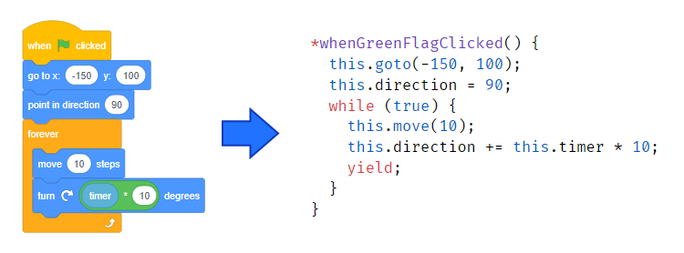

# Leopard



## What is this?

There are two main components to Leopard:

### 1. `Leopard`: A Javascript Library For Creating Games

Leopard is a library which makes it easy to create games in Javascript. The library handles rendering sprites, collision detection, audio, and more. It is designed to be easy-to-use for real human beings. If you're a person, you can make games with Leopard.

But Leopard also has a second trick up its sleeve...

### 2. `sb-edit`: A Compiler to Transform Scratch Projects

The design of the Leopard library closely mimics that of the [Scratch](https://scratch.mit.edu/) programming language. This is no accident; it allows for **direct, easy translation from Scratch to JavaScript.** There are a lot of reasons why this is difficult without the library (mostly the way that Scratch handles asynchronous code), but with Leopard alongside, the translation is stupid simple.

All of this means that a compiler can exist which translates Scratch projects directly into usable Javascript via [sb-edit](https://github.com/PullJosh/sb-edit). This isn't ugly compilation that leaves little room for human input. The final code is clear and concise, exactly the same as the Scratch project from which it is created.

## Usage

### Step 1: Get the code

```
> git clone https://github.com/PullJosh/leopard.git
> cd leopard
> npm install
```

### Step 2: Serve the files

Everything in this repo can be opened in a browser directly. Unfortunately for us, javascript modules must come from a server like `localhost` rather than straight from the file system, so **we need to serve the repo's files on localhost.**

There are plenty of different ways to do this. If you have `node` installed, you can use [`http-server`](https://www.npmjs.com/package/http-server):

```
> npx http-server -p 3000
```

Once you start the server, open http://localhost:3000/example-project/index.html to see the example project in action!
